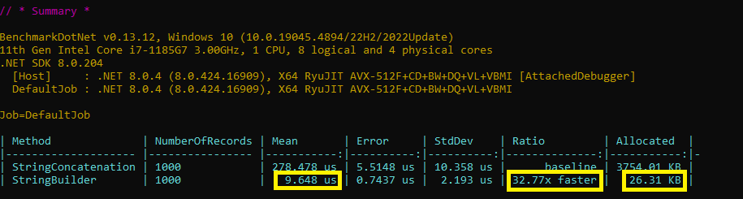

# String Concatenation vs StringBuilder Performance

🔥 En .𝗡𝗘𝗧, los String son inmutables, lo que significa que su contenido no puede cambiar una vez creado. Esto tiene implicaciones para la manipulación de cadenas.

Concatenación de String  
✅ Usa el operador + para combinar cadenas. 
✅ Crea un nuevo objeto 𝙨𝙩𝙧𝙞𝙣𝙜 en cada concatenación, lo que puede generar problemas de rendimiento con grandes cantidades de concatenaciones. 

StringBuilder 
✅ Representa una cadena mutable de caracteres. 
✅ Construye cadenas de manera eficiente mediante la adición de caracteres u otras cadenas. 
✅ Ideal para escenarios donde se realizan múltiples concatenaciones. 

🚀 Comparación de rendimiento

✅ StringBuilder es significativamente más rápido: La columna Ratio muestra claramente que StringBuilder es aproximadamente 32 veces más rápido que la concatenación de strings para 1000 registros.

✅ StringBuilder es más eficiente en memoria: La columna Allocated indica que StringBuilder consume significativamente menos memoria (26.31 KB en comparación con 3754.01 KB) que la concatenación de strings.

👉 El código de ejemplo está disponible en el siguiente repositorio: <a href="https://github.com/poorna-soysa/benchmark-examples">enlace al repositorio</a>

❓ ¿Qué opinas sobre la concatenación de strings y el StringBuilder?

