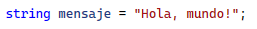
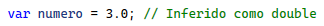
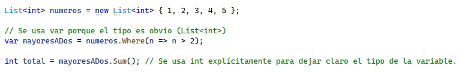

# Use of var or explicit type

🔥 La palabra clave <strong>var</strong> fue introducida en C# 3.0 y permite que el compilador infiera el tipo de una variable basado en el valor asignado. Mejora la legibilidad del código y puede reducir la redundancia. Sin embargo, es fundamental usar <strong>var</strong> de manera efectiva para mantener la claridad del código. 

<strong>1️⃣ Uso de var para mejorar la legibilidad   
Cuando usar var puede hacer el código más claro:</strong>  
✅ Cuando el tipo es obvio en la asignación.  Si el tipo de la variable es evidente en el contexto de la asignación, usar <b>var</b> puede hacer que el código sea más fácil de leer al reducir el ruido visual.
 

 
✅ Para tipos complejos o anónimos.  En casos donde el tipo es largo o complejo, <b>var</b> puede hacer que el código sea más legible sin sacrificar la claridad, especialmente cuando se trabaja con tipos de LINQ o clases anónimas.
 

 
Aquí, el tipo del objeto es anónimo (no tiene un nombre explícito), por lo que <b>var</b> es la única opción.   
✅ Con LINQ y otros casos de tipos inferidos.  Al trabajar con LINQ, <b>var</b> es útil para variables que contienen resultados de consultas donde el tipo puede ser complicado.  

 
En este caso, el tipo de resultado es IEnumerable<Persona>, lo cual puede ser un poco más largo y menos intuitivo de escribir que simplemente <b>var</b>.  
<strong>2️⃣ Uso del tipo explícito para mayor claridad  
Cuándo es preferible declarar el tipo explícitamente:</strong>  
✅ Cuando el tipo no es obvio. Si el tipo de la variable no es inmediatamente claro a partir de la asignación, es mejor declararlo explícitamente para evitar confusión. 

 
Aquí, aunque <b>var</b> podría inferir el tipo de ObtenerContador(), declarar int explícitamente aclara la intención al lector. 
✅ Para mejorar la comprensión de intenciones. Al usar tipos primitivos o bien conocidos, el tipo explícito puede ser más claro. Esto es particularmente útil en casos donde una simple asignación puede ser ambigua.  

 
Si se usa <b>var mensaje = "Hola, mundo!";</b> se entenderá que <b>mensaje</b> es una cadena, pero usar <b>string</b> explícitamente puede hacer más claro al lector que la variable <b>mensaje</b> se espera que sea una cadena de texto. 
✅ Para evitar inferencias incorrectas. A veces <b>var</b> puede hacer inferencias inesperadas. Por ejemplo:

 
Si realmente querías que <b>numero</b> fuera un tipo decimal, es preferible especificarlo:
 

  
<strong>🚀 Ejemplo práctico de combinación</strong> 
A continuación, un ejemplo que combina <b>var</b> y tipos explícitos para hacer el código claro y fácil de leer: 

 
En este ejemplo, <b>mayoresADos</b> es inferido como <b>IEnumerable&lt;int&gt;</b>, que es lo que esperamos, y <b>total</b> es explícitamente <b>int</b>, lo cual puede ayudar a identificar un posible error si <b>Sum()</b> devuelviera otro tipo de dato.   
<strong>🔥 Recomendación general</strong>  
✅ Usa <i>var</i> <b>cuando el tipo es obvio o el tipo es complejo</b> y su uso no disminuye la claridad. 
✅ Usa el <b>tipo explícito</b> cuando el tipo no es evidente o para hacer que el código sea más claro en términos de intención y legibilidad.  
👉 Cada uno tiene su momento adecuado, y una combinación de ambos generalmente lleva a un código más limpio y comprensible.
